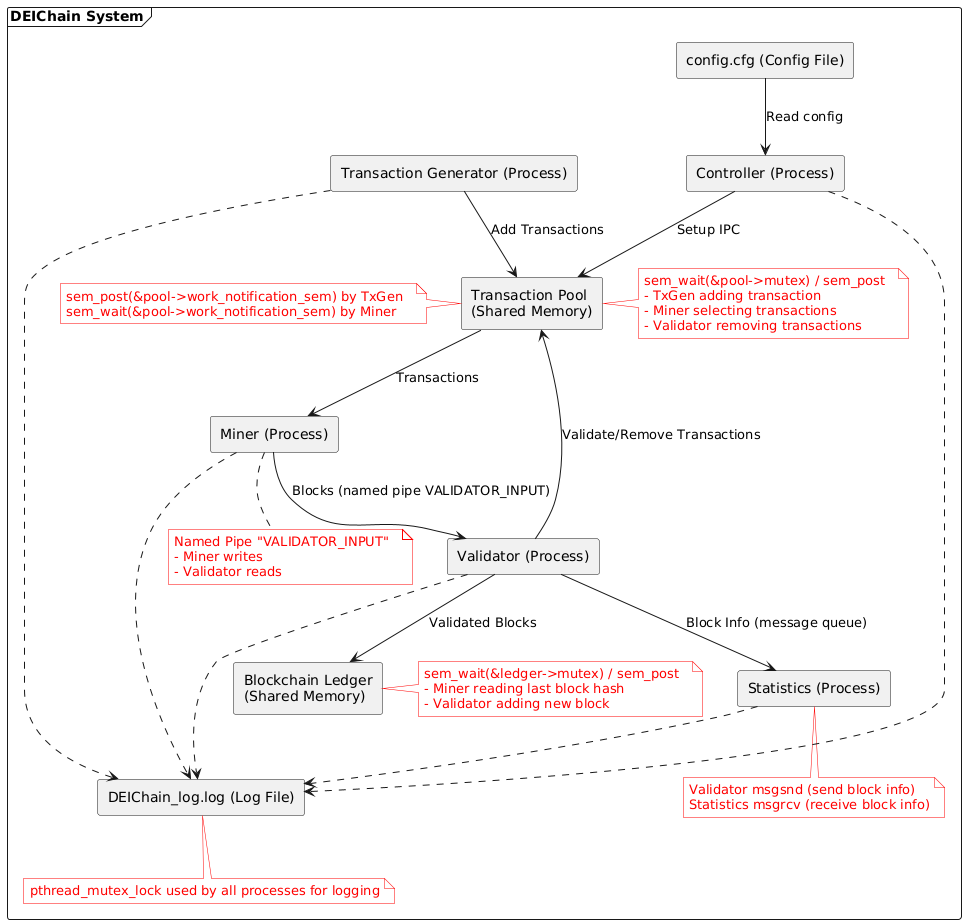

# DEIChain — Relatório SO2

---

## Componentes

### Controller
Responsible for reading the configuration file and setting up all IPC resources: shared memory segments (for the pool and ledger), semaphores (mutexes and notification), a message queue, and a named pipe. It launches the other processes and handles shutdown and signals (e.g., `SIGUSR1` to dump the ledger). It ensures the entire simulation lifecycle is coordinated centrally.

### Transaction Generator (TxGen)
A lightweight process that periodically generates random transactions and inserts them into the shared Transaction Pool. It uses `sem_wait(&pool->mutex)` and `sem_post` to ensure exclusive access while adding a transaction. After a successful insert, it notifies the miners by calling `sem_post(&work_notification_sem)`.

### Transaction Pool (Shared Memory)
A fixed-size array of transactions shared among TxGen, Miner, and Validator.
- `pool->mutex`: A binary semaphore used to synchronize all access/modifications.
- `work_notification_sem`: A counting semaphore posted by TxGen to wake miners, and waited on by miners to detect new transactions.

The pool also tracks occupancy, used to trigger scaling of Validator processes.

### Miner
Each Miner thread waits on `work_notification_sem`, selects transactions from the pool (protected by `pool->mutex`), builds a block, performs Proof-of-Work (PoW), and sends the completed block via the named pipe `VALIDATOR_INPUT`. It reads the latest blockchain state under `ledger->mutex` to ensure correct linkage. If the PoW fails or the block cannot be validated, reserved transactions are returned to the pool.

### Validator
Reads blocks from the named pipe, validates PoW, checks the previous hash against the blockchain (protected by `ledger->mutex`), and confirms that all transactions exist in the pool. If valid, it appends the block to the Blockchain Ledger and removes transactions from the pool (using `pool->mutex`). It sends results to the Statistics process via a message queue. The primary Validator also monitors pool occupancy and forks or terminates extra Validator processes accordingly.

### Statistics
Listens for messages from the Validators via the message queue. It aggregates per-miner stats (valid blocks, invalid blocks, total rewards) and prints them upon receiving `SIGUSR1` or on shutdown. It ensures that performance data is collected without interfering with core processes.

### Blockchain Ledger (Shared Memory)
A sequential list of validated blocks. Access is synchronized via `ledger->mutex` to ensure only one Validator can write at a time, and Miners read consistent data. Blocks are stored along with their transactions in contiguous memory areas.

---

## Synchronization Summary

### Semaphores
- `pool->mutex`: Ensures exclusive access to the Transaction Pool (used by TxGen, Miner, Validator).
- `work_notification_sem`: Used by TxGen to notify Miners when new transactions are available.
- `ledger->mutex`: Protects Blockchain Ledger during reads (by Miners) and writes (by Validators).

### Named Pipe (`VALIDATOR_INPUT`)
Used for Miners to send blocks to the Validator. Multiple Miners write to the pipe, and Validators use `select()` to read without blocking the main loop.

### Message Queue
Used by Validators to send statistics to the Statistics process asynchronously. This ensures Validators do not block and Statistics can receive data reliably.

### pthread Mutex (Logger)
All processes use a shared logging function protected by a `pthread_mutex` to prevent interleaved or corrupted log entries in `DEIChain_log.log`.
